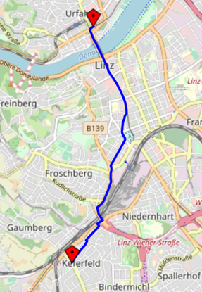

[](https://classroom.github.com/a/zpopdNsF)
# **SWE4-Übungen - SS2024 - Übungszettel 4**

## Minimale Pfade in Graphen (src/astar)

Navigationstechnologien haben in den letzten Jahren eine rasante Entwicklung
durchgemacht und sind heute aus dem Alltag kaum noch wegzudenken. Moderne
Navigationssysteme sind nicht nur in High-End-Fahrzeugen, sondern auch in vielen
Mittelklassewagen serienmäßig verbaut. Auch für mobile Geräte sind zahlreiche
Navigations-Apps verfügbar. Die Kernaufgabe jeder Navigationssoftware ist die
Berechnung der kürzesten bzw. der schnellsten Verbindung zwischen zwei Orten.
Das Ergebnis einer derartigen Berechnung ist in der nachfolgenden Abbildung
dargestellt. 

<div align="center">
  
</div>

Ein effizienter Algorithmus zur Lösung dieses
Problems ist der so genannte _A*-Algorithmus_, der von Peter Hart, Nils Nilsson
und Bertram Raphael bereits 1968 entwickelt wurde. In dieser Übungsaufgabe
sollen Sie ein Java-Programm implementieren, mit dem ein Graph zur
Repräsentierung eines Straßennetzwerkes aufgebaut werden kann und das mithife
des A*-Algorithmus Routingaufgaben effizient lösen kann. Realisieren Sie dieses
Programm in folgenden Schritten:

1.  Studieren Sie den A*-Algorithmus gründlich. Eine übersichtliche Darstellung des
    Algorithmus findet man beispielsweise auf auf Wikipedia unter
    <https://en.wikipedia.org/wiki/A*_search_algorithm>. Machen Sie zunächst einen
    Schreibtischtest für ein einfaches Beispiel, bevor Sie mit der
    Implementierung beginnen. Entwerfen Sie eine geeignete Datenstruktur zur
    Repräsentierung von Graphen. Machen Sie möglichst weitreichend Gebrauch von
    den bestehenden Behälterklassen des JDK. Legen Sie Ihre Datenstruktur so aus,
    dass vor allem die für den A*-Algorithmus erforderlichen Operationen
    effizient durchgeführt werden können. Die Klasse `Graph` sollte zunächst
    folgende Methoden unterstützen:

    ```java
    package swe4.gis; 
    public class Graph {
      public long addVertex(double longitude, double latitude);
        // returns id of new vertex
      public void addEdge(String name, long startVertexId, long endVertexId, 
                          double length) throws InvalidVertexIdException;
      public Collection<Vertex> getVertices();  
      public Collection<Edge> getEdges();
      public Collection<Edge> findShortestPath(long idStartVertex, 
                                              long idTargetVertex);
      public double pathLength(Collection<Edge> path);
    }
    ```

    Implementieren Sie die Methode `findShortestPath` auf Basis des A*-Algorithmus. Legen Sie ein besonderes Augenmerk auf die Laufzeitkomplexität dieser Methode.

    Entwickeln Sie auf Basis von JUnit eine umfangreiche Testsuite, welche die
    Korrektheit Ihrer Implementierung auf systematische und reproduzierbare Art
    und Weise überprüft. Testen Sie vor allem die Methoden `findShortestPath`.
    Konstruieren Sie Testfälle, bei denen alle Pfade Ihres Algorithmus
    durchlaufen werden – insbesondere jeder, bei dem ein kürzerer Weg zu einem
    Knoten in der Liste der offenen Knoten gefunden wurde.

    Wenden Sie Ihre Testsuite auf die Lösung der Kollegin/des Kollegen an, die/der
    Ihnen in der Review-Phase zugeordnet wurde. Dokumentieren Sie die Ergebnisse
    dieses Testlaufs in Ihrer Review.

2.  Ihre bisherige Lösung kann lediglich den kürzesten Weg zwischen zwei Knoten
    berechnen. Meistens ist man an der schnellsten Route interessiert, d. h. an
    jener Route, die in der kürzesten Zeit zurückgelegt werden kann. Erweitern
    Sie daher die Klasse `Graph` um die Methoden `findMinimalPath` und
    `pathCosts`:

    ```java
    public class Graph {
      …
      public void addEdge(String name, long startVertexId, long endVertexId, 
                      double length, short category) throws InvalidVertexIdException;
      public Collection<Edge> findMinimalPath(long idStartVertex, long idTargetVertex, 
                                              CostCalculator calc);
      public double pathCosts(Collection<Edge> path, CostCalculator calc)
    }
    ```
    ```java
    public interface CostCalculator {
      double costs(Edge edge);
      double estimatedCosts(Vertex v1, Vertex v2);
    }
    ```

    `findMinimalPath` führt die Kostenberechnung mithilfe eines
    `CostCalculator`-Objekts durch, das als zusätzlicher Parameter übergeben wird.
    Ansonsten weist `findMinimalPath` aber keine Unterschiede zu `findShortestPath`
    auf.
  
    Für die Berechnung der schnellsten Route benötigen Sie eine Implementierung des Interfaces `CostCalculator`, welche als Kostenfunktion (Methode `cost`), die zum Befahren eines Straßenstücks (Kante) benötige Zeit verwendet. Weisen Sie dazu jedem Straßenstück eine Kategorie zu (Eigenschaft `category`), welche die Qualität des Straßenstücks angibt (von Autobahn (1) bis Nebenstraße (6)). Wenn man nun für jede Straßenkategorie eine bestimmte Durchschnittsgeschwindigkeit annimmt, können daraus sehr einfach die Kosten für ein Straßenstück berechnet werden. Die Methode `estimatedCosts` sollte die untere Schranke für die Kosten zwischen zwei Knoten liefern. Da zwischen zwei Knoten im günstigsten Fall eine geradlinige Straßenverbindung der besten Kategorie bestehen kann, kann man die zur Bewältigung dieser Strecke notwendige Zeit als Schätzwert ansetzen.

    Erweitern Sie Ihre Testsuite und testen Sie vor allem die Methode
    `findMinimalPath` ausführlich. Wenden Sie auch diese Testfälle auf die
    Lösung Ihrer Review-Partnerin/Ihres Review-Partners an.

3.  Ihre Lösung muss nun den Praxistest bestehen. Auf der E-Learning-Plattform
    steht Ihnen dazu ein routingfähiges Straßennetz von Linz zur Verfügung, das
    aus _OpenStreetMap_ (OSM) extrahiert wurde. Kopieren Sie die in diesem
    ZIP-Archiv enthaltene CSV-Datei `streets_linz.csv` in `src/astar/resources`.
    Checken Sie diese relativ große Datei aber nicht ein! 
    
    Dieser in dieser Datei enthaltene Graph kann mit der Klasse `OsmReader`
    eingelesen, berechnete Routen können mithilfe der Klasse `OsmWriter` in ein
    HTML-Dokument konvertiert werden, das die Route in eine OSM-Karte
    eingebettet darstellt. Diese beiden Klassen und alle Abhängigkeiten stehen
    Ihnen im Template-Repository zur Verfügung.

    Ermitteln Sie auf dieser Basis die kürzeste und die schnellste Route zwischen
    verschiedenen Start- und Endpunkten im Stadtgebiet von Linz und stellen Sie das
    Ergebnis grafisch dar.