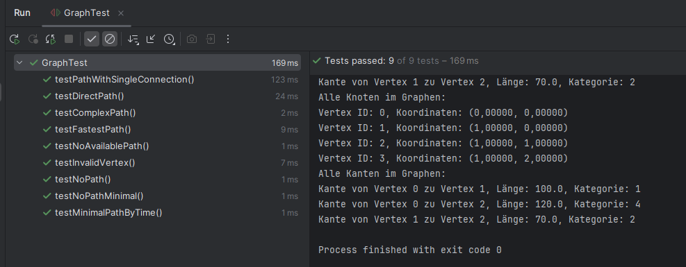
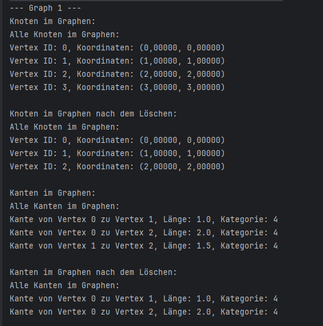
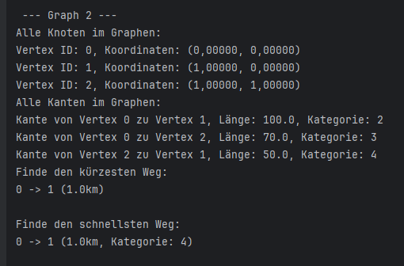
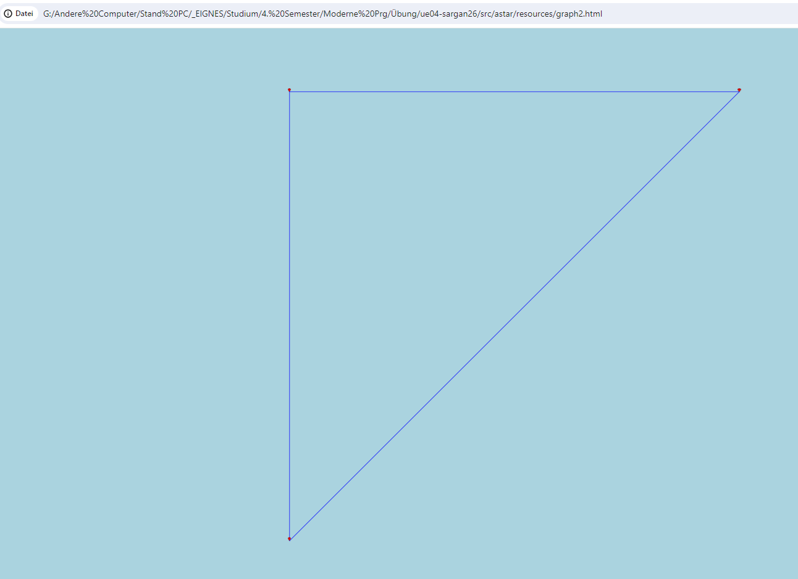
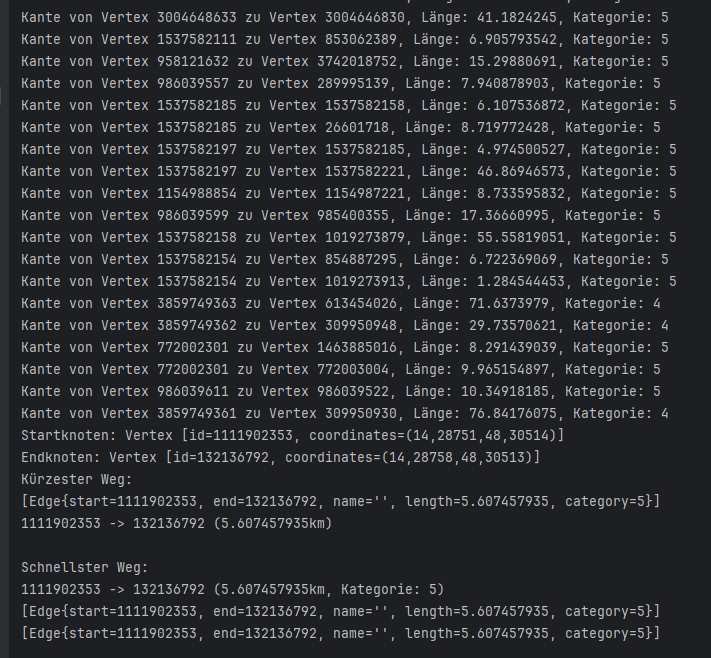
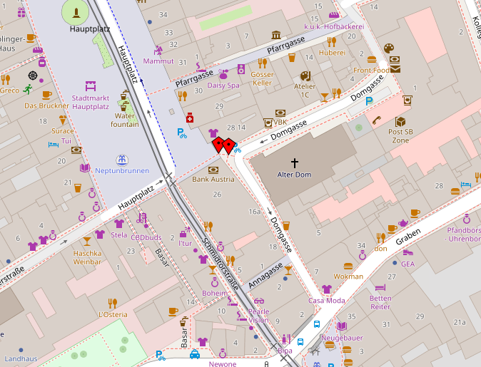
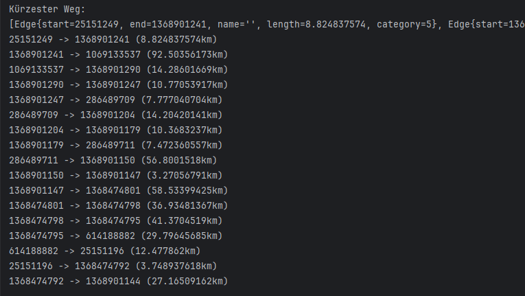
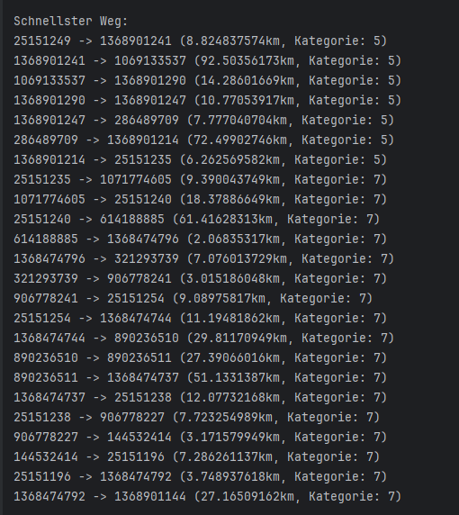

# **SWE4-Übungen - SS2024 - Übungszettel 4 - Ausarbeitung**

## Minimale Pfade in Graphen (src/astar)

### Überblick
Die Graph-Klasse ist darauf abzielt, effizient mit Graphendaten zu arbeiten, welche aus Knoten (Vertices) und Kanten (Edges) bestehen. Das System ermöglicht das Hinzufügen und Entfernen von Knoten und Kanten, das Ausgeben von Informationen sowie das Berechnen von Pfaden basierend auf verschiedenen Kriterien.

Dies ist die Hauptklasse der Implementierung, wo auch der Wegfindungsalgorithmus (A*) implementiert ist.

### Weitere Klassen

#### DistanceEvaluator
`DistanceEvaluator` ist eine Klasse, die zur Berechnung der Distanzkosten zwischen zwei Vertices dient. Diese Klasse implementiert das Interface `CostEvaluator`, welches die Methode `cost(Vertex start, Vertex end)` zur Kostenberechnung definiert. `DistanceEvaluator` verwendet geographische Koordinaten der Vertices, um die Distanz zu berechnen, meist durch euklidische Abstände oder andere geographische Metriken.

#### CostCalculator
`CostCalculator` ist eine abstrakte Klasse, die als Grundlage für spezifische Kostenberechnungen in verschiedenen Szenarien dient. Sie definiert allgemeine Methoden und Strukturen, die von abgeleiteten Klassen genutzt werden, um die Kosten eines Pfades oder einer Kante zu berechnen. Spezifische Implementierungen könnten unterschiedliche Faktoren berücksichtigen, wie Zeit, Geld oder Energieverbrauch.

#### CostEvaluator
`CostEvaluator` ist ein Interface, das Methoden für die Bewertung der Kosten eines Pfades zwischen zwei Knoten definiert. Implementierungen dieses Interfaces bestimmen, wie die Kosten berechnet werden, beispielsweise basierend auf Distanz, Zeit oder anderen Metriken. Dies ermöglicht eine flexible Anwendung verschiedener Kostenbewertungsstrategien in der Pfadfindung.

#### TimeEvaluator
`TimeEvaluator` implementiert das `CostEvaluator`-Interface und berechnet die Zeitkosten für die Überquerung einer Kante zwischen zwei Vertices. Die Berechnung könnte Faktoren wie die Geschwindigkeitsbeschränkungen und die Art der Verkehrswege einbeziehen.

#### TimeCostCalculator
`TimeCostCalculator` erweitert `CostCalculator` und spezialisiert sich auf die Berechnung von Reisekosten basierend auf Zeit. Diese Klasse könnte Methoden implementieren, um die Gesamtreisezeit eines Pfades zu berechnen, wobei Stopps, Verzögerungen und andere zeitbezogene Faktoren berücksichtigt werden.

#### Nutzung im Kontext
Die Klassen `CostCalculator`, `CostEvaluator`, `DistanceEvaluator`, `TimeEvaluator` und `TimeCostCalculator` sind zentral für das flexible und erweiterbare Design des Systems, welches es ermöglicht, verschiedene Kriterien für die Pfadberechnung zu berücksichtigen. Dies erlaubt es Nutzern, je nach Anforderung den geeignetsten Kostenrechner auszuwählen.

### Datenstrukturen
Die Hauptdatenstrukturen sind:
- **Vertex**: Repräsentiert einen Knoten im Graphen. Jeder Vertex hat eine eindeutige ID, Längen- und Breitengrade.
- **Edge**: Repräsentiert eine Kante zwischen zwei Vertices. Jede Edge hat Eigenschaften wie Start- und Endvertex, Namen, Länge und eine Kategorie.
- **Graph**: Verwaltet die Vertices und Edges. Die Vertices werden in einer `HashMap` gespeichert, die Edges in einer `HashMap`, die eine Adjazenzliste darstellt.

### Kernfunktionalitäten

#### Knotenverwaltung
- **Hinzufügen eines Knotens**: Über die Methode `addVertex` wird ein neuer Knoten mit ID, Längen- und Breitengraden erstellt und in den Graphen eingefügt.
- **Entfernen eines Knotens**: Über `removeVertex` wird ein Knoten und alle seine verbundenen Kanten aus dem Graphen entfernt.

#### Kantenverwaltung
- **Hinzufügen einer Kante**: Über `addEdge` wird eine neue Kante zwischen zwei Knoten hinzugefügt. Die Kanteninformationen umfassen Namen, Start- und Endvertex, Länge und Kategorie.
- **Entfernen einer Kante**: Mit `removeEdge` kann eine spezifische Kante aus dem Graphen gelöscht werden.

#### Pfadberechnung

- **Kürzester Pfad**: Die Methode `findShortestPath` berechnet den kürzesten Pfad basierend auf der Distanz zwischen zwei Knoten.
- **Minimaler Pfad**: `findMinimalPath` berechnet einen Pfad, der basierend auf einem gegebenen Kostenevaluator minimal ist, beispielsweise Zeit oder finanzielle Kosten.

### Implementierungsdetails
- **Fehlerbehandlung**: Die Methoden werfen spezifische Ausnahmen, wie `InvalidVertexIdException`, wenn ungültige ID-Werte verwendet werden.
- **Pfadberechnungsalgorithmus**: Nutzt den A*-Algorithmus mit einer Prioritätswarteschlange zur effizienten Pfadfindung unter Verwendung verschiedener Kostenbewertungen.

## Testfälle

Um die Funktionalität und Robustheit des Graphen-Verwaltungssystems zu gewährleisten, wurden umfassende Testfälle mit JUnit implementiert. Diese Testfälle decken verschiedene Szenarien ab, von der grundlegenden Funktionalität des Hinzufügens und Entfernens von Vertices und Edges bis hin zu komplexeren Pfadfindungsalgorithmen.

```java
import org.junit.jupiter.api.AfterEach;
import org.junit.jupiter.api.BeforeEach;
import org.junit.jupiter.api.Test;
import swe4.gis.Edge;
import swe4.gis.Graph;
import swe4.gis.InvalidVertexIdException;
import swe4.gis.test.TimeCostCalculator;
import swe4.gis.test.TimeEvaluator;

import static org.junit.jupiter.api.Assertions.*;
import java.util.*;

public class GraphTest {
    private Graph graph;
    private long id0, id1, id2, id3;  // Halte die IDs der Knoten
    private TimeCostCalculator timeCalculator;

    @BeforeEach
    public void setUp() throws InvalidVertexIdException {
        graph = new Graph();
        timeCalculator = new TimeCostCalculator();
        // Knoten hinzufügen und ID speichern
        id0 = graph.addVertex(0, 0, 0); // Start
        id1 = graph.addVertex(1,0, 1); // Midway
        id2 = graph.addVertex(2,1, 1); // End
        id3 = graph.addVertex(3, 2, 1); // Isolated

        graph.addEdge("Edge0", id0, id1, 100, (short) 1); // Autobahn, 100 km
        graph.addEdge("Edge1", id1, id2, 70, (short) 2);  // Bundesstraße, 70 km
        graph.addEdge("Edge2", id0, id2, 120, (short) 4); // Stadtstraße, 120 km

        graph.printAllVertices();
        graph.printAllEdges();
    }

    @AfterEach
    public void tearDown() {
        // Optional: Clear the graph if it's not reconstructed in each test
        graph.clear(); // You would need to implement this method in your Graph class
    }

    @Test
    public void testDirectPath() {
        Collection<Edge> path = graph.findShortestPath(id0, id1);
        assertNotNull(path, "Path should not be null");
        assertEquals(1, path.size(), "Path should have 1 edge");
    }

    @Test
    public void testComplexPath() {
        Collection<Edge> path = graph.findShortestPath(id0, id2);
        assertNotNull(path, "Path should not be null");
        assertEquals(id1, path.size(), "Path should have 2 edges");
    }

    @Test
    public void testNoPath() {
        graph.removeEdge(id1, id2); // Entferne die Kante, um den Pfad zu unterbrechen
        Collection<Edge> path = graph.findShortestPath(id1, id2);
        assertTrue(path.isEmpty(), "Path should be empty");
    }

    @Test
    public void testInvalidVertex() {
        assertThrows(InvalidVertexIdException.class, () -> {
            graph.addEdge("FailingEdge", 4, 5, 1.0); // IDs existieren nicht
        }, "Expected InvalidVertexIdException");
    }

    @Test
    public void testFastestPath() {
        Collection<Edge> path = graph.findMinimalPath(id0, id2, timeCalculator);
        assertNotNull(path, "Path should not be null");
        assertEquals(2, path.size(), "Path should take the fastest route with 2 edges");
        double totalTravelTime = graph.pathCosts(path, timeCalculator);
        assertTrue(totalTravelTime < 150, "Total travel time should be less than 150 minutes");
    }

    @Test
    public void testNoPathMinimal() {
        graph.removeEdge(id1, id2); // Entferne die Kante, um den Pfad zu unterbrechen
        Collection<Edge> path = graph.findMinimalPath(id1, id2, timeCalculator);
        assertTrue(path.isEmpty(), "Path should be empty");
    }

    @Test
    public void testMinimalPathByTime() {
        Collection<Edge> path = graph.findPath(id0, id2, new TimeEvaluator(timeCalculator));
        assertNotNull(path, "Path should not be null");
        assertEquals(2, path.size(), "Path should include two edges using the fastest route based on time");
        double totalTime = graph.pathCosts(path, timeCalculator);
        assertTrue(totalTime < 140, "Total travel time should be realistic and calculated correctly based on speeds");
    }

    @Test
    public void testNoAvailablePath() {
        Collection<Edge> path = graph.findPath(id0, id3, new TimeEvaluator(timeCalculator));
        assertTrue(path.isEmpty(), "Path should be empty as there is no available route");
    }

    @Test
    public void testPathWithSingleConnection() {
        graph.removeEdge(id0, id2); // Remove the longer direct connection
        Collection<Edge> path = graph.findPath(id0, id2, new TimeEvaluator(timeCalculator));
        assertEquals(2, path.size(), "Path should route through the middle vertex since direct is removed");
    }

}
```


Test allgemeiner Graph-Funktionen

```java
           System.out.println("--- Graph 1 ---");
            Graph graph = new Graph();

            // Knoten hinzufügen
            long id1 = graph.addVertex(0,0.0, 0.0);
            long id2 = graph.addVertex(1,1.0, 1.0);
            long id3 = graph.addVertex(2,2.0, 2.0);
            long id4 = graph.addVertex(3, 3.0, 3.0);

            // Alle Knoten ausgeben
            System.out.println("Knoten im Graphen:");
            graph.printAllVertices();

            // Einen Knoten löschen
            graph.removeVertex(id4);

            // Knoten nach dem Löschen ausgeben
            System.out.println("\nKnoten im Graphen nach dem Löschen:");
            graph.printAllVertices();

            // Kanten hinzufügen
            graph.addEdge("Edge1", id1, id2, 1.0);
            graph.addEdge("Edge2", id2, id3, 1.5);
            graph.addEdge("Edge3", id1, id3, 2.0);

            // Alle Kanten ausgeben
            System.out.println("\nKanten im Graphen:");
            graph.printAllEdges();

            // Eine Kante löschen
            graph.removeEdge(id2, id3);

            // Kanten nach dem Löschen ausgeben
            System.out.println("\nKanten im Graphen nach dem Löschen:");
            graph.printAllEdges();
```


Test der Pfadberechnung

```java
            System.out.println("--- Graph 2 ---");
            Graph graph = new Graph();

            // Knoten hinzufügen
            long id1 = graph.addVertex(0,0.0, 0.0);
            long id2 = graph.addVertex(1,1.0, 1.0);
            long id3 = graph.addVertex(2,2.0, 2.0);
            long id4 = graph.addVertex(3, 3.0, 3.0);

            // Kanten hinzufügen
            graph.addEdge("Edge1", id1, id2, 1.0);
            graph.addEdge("Edge2", id2, id3, 1.5);
            graph.addEdge("Edge3", id1, id3, 2.0);

            // Kürzester Pfad
            System.out.println("\nKürzester Pfad von Knoten 1 zu Knoten 3:");
            Collection<Edge> shortestPath = graph.findShortestPath(id1, id3);
            graph.printPath(shortestPath);

            // Minimaler Pfad
            System.out.println("\nMinimaler Pfad von Knoten 1 zu Knoten 3:");
            Collection<Edge> minimalPath = graph.findMinimalPath(id1, id3, new DistanceEvaluator());
            graph.printPath(minimalPath);
```





Test der CSV

```java
            System.out.println("\n\n --- Graph 3 ---");
// OsmReader erstellen und CSV-Datei einlesen
OsmReader osmReader = new OsmReader("src/astar/resources/streets_linz.csv");

Graph graph3 = new Graph();

// Eine Map verwenden, um bereits hinzugefügte Vertices zu speichern
Map<Long, Vertex> vertexMap = new HashMap<>();

            while (osmReader.hasMoreEdges()) {
EdgeData edgeData = osmReader.nextEdge();

// Überprüfen und Hinzufügen des Startknotens
Vertex startVertex = vertexMap.get(edgeData.getStartId());
                if (startVertex == null) {
startVertex = new Vertex(edgeData.getStartId(), new SphericPoint(edgeData.getStart().getLongitude(), edgeData.getStart().getLatitude()));
        graph3.addVertex(startVertex.getId(), startVertex.getCoordinates().getLongitude(), startVertex.getCoordinates().getLatitude());
        vertexMap.put(edgeData.getStartId(), startVertex);
        }

// Überprüfen und Hinzufügen des Endknotens
Vertex endVertex = vertexMap.get(edgeData.getEndId());
                if (endVertex == null) {
endVertex = new Vertex(edgeData.getEndId(), new SphericPoint(edgeData.getEnd().getLongitude(), edgeData.getEnd().getLatitude()));
        graph3.addVertex(endVertex.getId(), endVertex.getCoordinates().getLongitude(), endVertex.getCoordinates().getLatitude());
        vertexMap.put(edgeData.getEndId(), endVertex);
        }

// Erstellen und Hinzufügen der Kante
Edge edge = new Edge(startVertex, endVertex, edgeData.getName(), edgeData.getLength(), edgeData.getCategory());

                graph3.addEdge(edge.getName(), edge.getStart().getId(), edge.getEnd().getId(), edge.getLength(), edge.getCategory());
        }
        osmReader.close();


// Ausgabe
            graph3.printAllVertices();
            graph3.printAllEdges();


// Testen von shortestPath und fastestPath mit verschiedenen Start- und Endpunkten
Vertex startVertex = graph3.getVertex(1111902353);
Vertex endVertex = graph3.getVertex(132136792);
            System.out.println("Startknoten: " + startVertex);
            System.out.println("Endknoten: " + endVertex);

// Finde den kürzesten Weg
shortestPath = graph3.findShortestPath(startVertex.getId(), endVertex.getId());
        System.out.println("Kürzester Weg:");
            System.out.println(shortestPath);
            for (Edge edge : shortestPath) {
        System.out.println(edge.getStart().getId() + " -> " + edge.getEnd().getId() + " (" + edge.getLength() + "km)");
        }


// Finde den schnellsten Weg
fastestPath = graph3.findMinimalPath(startVertex.getId(), endVertex.getId(), timeCalculator);
        System.out.println("\nSchnellster Weg:");
            for (Edge edge : fastestPath) {
        System.out.println(edge.getStart().getId() + " -> " + edge.getEnd().getId() + " (" + edge.getLength() + "km, Kategorie: " + edge.getCategory() + ")");
        }

        // Schreiben des gesamten Graphen
        writer.writeGraph(graph3, "graph3");

// Schreiben eines Pfads
            System.out.println(fastestPath);
            System.out.println(shortestPath);
            writer.writePath(fastestPath, "fastestPath3");
            writer.writePath(shortestPath, "shortestPath3");
```





Weiterer Testfall

```java
            Vertex startVertex = graph3.getVertex(25151249);
            Vertex endVertex = graph3.getVertex(1368901144);
```



